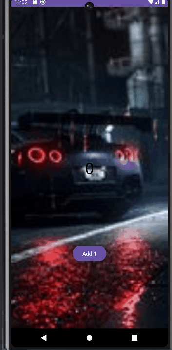

# Android Project 1 - *SimpleCounter*

Submitted by: **Zak Kafeero**

**SimpleCounter** is a simple counter app, similar to popular idle tap mobile games. 

Time spent: **2** hours spent in total

## Required Features

The following **required** functionality is completed:

- [x ] **Run your app, and you should see a number and a button**
- [x ] **Detect when the user clicks on the button**
- [x ] **Update the number displayed when the button is clicked**

The following **optional** features are implemented:

- [ x] Show upgrades when available
- [ x] Add a theme for your app 

The following **additional** features are implemented:

* [ ] List anything else that you can get done to improve the app functionality!

## Video Walkthrough

Here's a walkthrough of implemented user stories:

<!-- Replace this with whatever GIF tool you used! -->
GIF created with ...  
<!-- Recommended tools:
[Kap](https://getkap.co/) for macOS
[ScreenToGif](https://www.screentogif.com/) for Windows
[peek](https://github.com/phw/peek) for Linux. -->

## Notes

Describe any challenges encountered while building the app.

## License

    Copyright [yyyy] [name of copyright owner]

    Licensed under the Apache License, Version 2.0 (the "License");
    you may not use this file except in compliance with the License.
    You may obtain a copy of the License at

        http://www.apache.org/licenses/LICENSE-2.0

    Unless required by applicable law or agreed to in writing, software
    distributed under the License is distributed on an "AS IS" BASIS,
    WITHOUT WARRANTIES OR CONDITIONS OF ANY KIND, either express or implied.
    See the License for the specific language governing permissions and
    limitations under the License.
